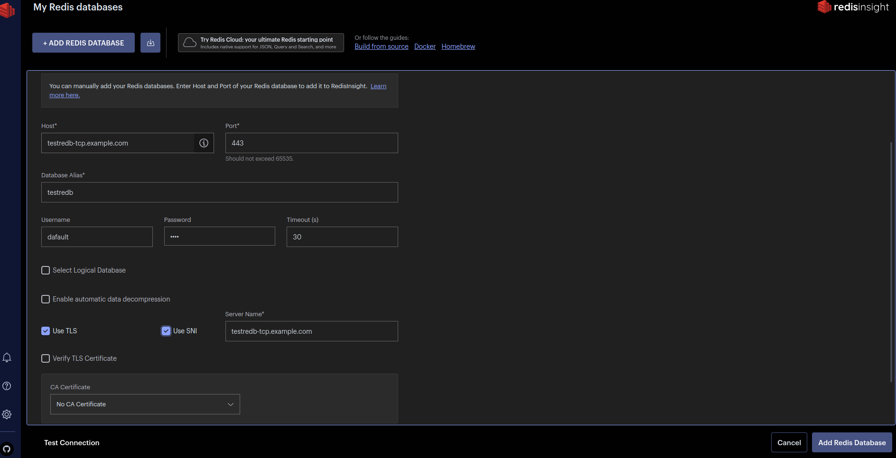

# Redis database - redb

Redis database Helm Chart uniquement pour Redis Enterprise Kubernetes

## Code source

* [github Redis Enterprise](https://github.com/RedisLabs/redis-enterprise-k8s-docs) branch `version redis, exemple: 7.2.4-7` :

A chaque upgrade copier les fichiers `role.yaml` et `role-binding.yaml` **uniquement si il y a une différence** dans ce projet en **rajoutant les labels/annotations spécifiques dans ce projet [role.yaml](./source-chart/templates/role.yaml) and [role-binding.yaml](./source-chart/templates/role-binding.yaml)
Mettre à jour `les versions et modules`` dans le fichier [redis-enterprise-database.yaml](./source-chart/templates/redis-enterprise-database.yaml)

## Valeurs
[Description des valeurs possibles du fichier values.yaml](./values-prod.yaml)
[options redb site officiel](https://docs.redis.com/latest/kubernetes/reference/db-options/)
| Clé | Type | Valeur par défaut | Description |
|-----|------|---------|-------------|
| databaseName | string | `"testredb"` | The name of the database to use. |
| databasePort | number | `"none"` | [Choisir un port entre 10000 à 19999.](https://docs.redis.com/latest/kubernetes/reference/db-options/) |
| memorySize | string | `"128MB"` | The size of the database MB, GB. Default 128MB |
| redisVersion | string | `"latest"` | [Version de ma database 2 choix `major ou latest`](https://docs.redis.com/latest/kubernetes/reference/db-options/)|
| replication | bool | `"false"` | [aide au choix](./REDIS.md)|
| shardCount | number | `1` | [aide au choix](./REDIS.md)  |
| persistence | keyword | `"aofEverySecond"` | [différentes persistance possible](https://docs.redis.com/latest/rs/databases/configure/database-persistence/)  |
| auth.enabled | bool | `"false"` | fixer un mot de passe pour la base. Par défaut redis créé un mot de passe aléatoire.  |
| auth.password | string | `"none"` | permet de fixer son mot de passe pour la base, encoder dans un secret à la création |
| backup.enabled | bool | `"false"` | `feature en cours`, backup de la database  |
| ingressTCP.enabled | bool | `"false"` | accés à une database depuis l'extérieur (test, redisinsight) `port fixe 443` |
| ingressTCP.host | string | `"none"` | url d'accès avec le `dns wildcard du cluster k8s` |
| module.enabled | bool | `"false"` | permet d'activer 1 ou plusieurs modules à choisir  |
| module.modulesList | object | `"none"` | liste du ou des modules à activer dans le [fichier values.yaml partie modulesList](./source-chart/values.yaml)  |

## Exemples :
- Création d'une database avec les options par défaut
```bash
cd source-chart
helm upgrade --install testredb . --create-namespace --namespace testredb
```
- Suppression d'un database
**Attention ne jamais supprimer directement un namespace** avec une base de donnée redis, même en developpement.
D'abord désinstaller la base via le chart helm et ensuite vous pouvez supprimer le namespace
```bash
# uninstall with helm
helm uninstall testredb
# delete namespace
kubectl delete ns testredb
```

## Accès à une base redis REDB :

Il exite 2 besoins :
depuis l'intérieur ou l'extérieur d'un cluster kubernetes

### depuis l'intérieur d'un cluster kubernetes :

Par défaut la database redis crée dynamiquement un port.
Vous pouvez faire le choix de le fixer pour simplifier et garantir la répétabilité d'appel de service frontend.
Par contre vous devrez vous assurer que ce port est garantie du dev à la production

Attention le choix d'un port fixe ou dynamique est à faire au départ. Vous ne pourrez plus changer après la création de la database REDB.

```yaml
# Valeur du chart pour l'exemple
databasePort: 10001
```

### depuis l'extérieur d'un cluster kubernetes :

pour des besoins de test, ou d'accès à une base via l'outil redisinsight.
Dans le chart helm activer et configure votre host.
Uniquement compatible traefik
```yaml
# Values pour l'exemple
ingressTCP:
  enabled: true
  host: testredb-tcp.example.com
```

Pour l'exemple redis-cli 
```bash
redis-cli -h testredb-tcp.example.com -p 443 --user default --pass test --tls --sni testredb-tcp.example.com
```

Configuration redisinsight avec le même exemple :
Utiliser redisinsight sur vos postes de travail et prosrcrire le déploiement sur un cluster k8s pour des raisons de sécurité.


## Upgrade version REC et REDB:

Le cycle de vie se fait en 2 étapes, aucune action pour les équipes produits

- 1er cycle : l'upgrade de la version des cluster Redis Enteprise Cluster (REC)
- 2ème cycle : après une période, mettre en place un upgrade de toutes les databases REDB en approche canary release