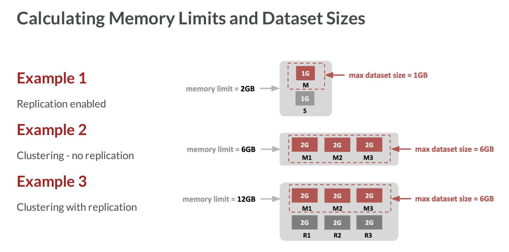

# Bonne pratiques
Pour le moment les clusters redis sont sur des plans petit.
Cela évoluera en fonction des besoins.

Les conditions d'ajout de shard :
1 shard = 25 000 op/s et < 25Go pour la redb
2 shard = 50 000 op/s et < 50Go pour la redb

# Choisir la taille mémoire, sharding, réplication
## environnement de sandbox/dev
exemple :
- **base redb** = `**1500Mo maximum**`
- **dataset utile** : `**1500Mo**`, `**replication false**`

## environnement de preprod/prod

- **base redb** = `**12Go maximum**`
- **dataset utile** : `**6Go**`, `**replication=true**` (non préconisé en production, cela dépend du SLA)**
- **dataset utile** : `**12Go**`, `**replication false**` (non préconisé en production, cela dépend du SLA)

